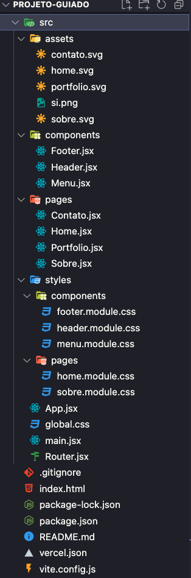

<h1 align="center">
  
</h1>

# On23-TodasEmTech-Santander-ReactJS-III

Esta é a 15ª semana da turma online: Todas em Tech 0n23 - Front-end, nesta aula do dia 01/07/2023 teremos os seguintes conteúdos:

  - [1. Router](#1-rotas---react-router)
  - [2. CSS no React](#2-como-usar-css-em-react)
  - `Projeto Guiado`

## Apresentação

### Quem é a professora Lilit?


[Lilit Bandeira](https://www.instagram.com/lilitravesti), é uma travesti paraibana residente no São Paulo, trabalho como Software Engineer no Nubank, ex-aluna e professora {reprograma} e professora também no minas programam, estudante de Analise e Desenvolvimento de Sistemas na Mackenzie;

#### Contatos

- [E-mail](devlilitbandeira@gmail.com)
- [LinkedIn](https://www.linkedin.com/in/lilitbandeira)
- [GitHub](https://github.com/lilitbandeira)

### Quem são as monitoras?


### Quem são as alunas?


## Acordos

- Enviar dúvidas no chat com as monitoras;
- Levantar a mão sempre que desejar falar, o que pode ser feito a qualquer momento;
- Manter microfones desligados sempre que alguém estiver falando;
- Manter as câmeras ligadas o máximo de tempo possível;

# Plano de Aula

## Conhecendo o projeto

## 🧠 Contexto

O objetivo é criar um site usando ReactJS, onde você possa se apresentar e enriquecer o seu portfólio, além de treinar todos os conteúdos vistos no módulo de ReactJS.

Vem aqui conferir como será nosso resultado final: https://site-pessoal-react-eight.vercel.app/

## O site pessoal conterá 4 páginas:

* Home
* Sobre
* Portfolio
* Contato

Todas as páginas terão os componentes:

* Menu
* Header
* Footer

## Estrutura do projeto



<br />

## `Tecnologias que usaremos`

| Ferramenta | Descrição |
| --- | --- |
| `ReactJS` | framework web|
| `Vite` | gerador de projeto de front-end|
| `npm` | gerenciador de pacotes|
| `Firebase` | Ferramenta realtime database para gravar as mensagens de contato|
| `Module CSS` | Ferramenta para ter mais produtividade ao estilizar a aplicação|
| `Phosphor` | Dependência com icones super legais|
| `React router dom` | Dependência para criar rotas no reactjs|
| `Axios` | Dependência para consumir api|
| `Vercel` | Hospedagem para a aplicação, fiz o deploy integrado com o github|
| `Github` | Hospedagem do código fonte integrado com gerenciador de versionamento|


>Passo a passo

`Sábado`
1) Criar o projeto com Vite
2) Apagar arquivos padrão
3) Faz o "Olá, Projeto Guiado!"
4) Instala react-router-dom
5) Cria o router v1 com html no element, importa no App e testa no navegador
6) Cria o menu (ainda sem estilo) e usa no Router
7) Cria as 4 páginas apenas com o h1 (ainda sem estilo)
8) Importa as páginas no Router e testa no navegador
9) Vamos começar a estilizar: incluir fonte, criar o css global e criar o css do menu
10) Criar o componente Header estilizado e com props
11) Criar o componente Footer estilizado e usar no Router
12) Incluir conteúdo na página Contato estilizada

`Para segunda`

14) Criar e integrar firebase com variaveis de ambiente na página Contato
15) Fazer a página Home estilizada
16) Incluir config da vercel 
17) Subir no github e fazer deploy (importante criar as variaveis de prod na vercel)

`Para casa e correção de sexta`

18) Fazer a página Sobre estilizada
19) Fazer a página Portfólio estilizada (com dados internos e consumindo api no github)
20) Criar README.md do projeto
21) Subir no github e garantir que o deploy ocorreu bem
22) Customizar o projeto e mudar imagens
23) Incluir links do github e do projeto no ar no Classroom

## 1. Rotas - React Router

Lembra que com react estamos construindo SPA(single page application)? O que significa dizer que na real a gente só construiu uma única página. E quando a gente precisa criar um menu e algumas páginas diferentes. Precisamos usar uma biblioteca que nos ajude com isso, a construir rotas no react.

Para que no fim das contas, quando clicarmos no menu ou alterarmos na URL a gente consiga visualizar o conteúdo correto. Vamos aprender a usar a biblioteca react-router-dom.

1) Vamos instalar com o npm 

```bash
npm install react-router-dom@6
```

2) Vamos criar o arquivo que irá gerenciar nossos endereços

```jsx
import {  
  BrowserRouter,
  Routes,
  Route
} from 'react-router-dom';

import Home from '../Pages/Home'
import Sobre from '../Pages/Sobre'
import Portfolio from '../Pages/Portfolio'
import Contato from '../Pages/Contato'

function ApplicationRoutes(){
  return(
    <BrowserRouter>
      <Routes>
        <Route path="/" element={<Home />} />
        <Route path="sobre" element={<Sobre />} />
        <Route path="portfolio" element={<Portfolio />} />
        <Route path="contato" element={<Contato />} />
      </Routes>
  </BrowserRouter>
  )
}
export default ApplicationRoutes
```

3) Vamos criar o menu

```jsx
import { Link } from 'react-router-dom'

const Menu = () =>{
  return(
    <ul className="menu">
      <li>
        <Link className="link" to="/">Home</Link>
      </li>
      <li>
        <Link  className="link" to="/sobre">Sobre</Link>
      </li>
      <li>
        <Link  className="link" to="/portfolio">Portfólio</Link>
      </li>
      <li>
        <Link className="link" to="/contato">Contato</Link>
      </li>
    </ul>
  )

}

export default Menu
```

4) Podemos usar o menu nas páginas

5) No app em vez de chamar cada página, iremos usar as Rotas

```jsx
import ApplicationRoutes from './ApplicationRoutes'

function App() {
  return (
    <div>      
      <ApplicationRoutes/>    
    </div>   
  )
}

export default App;
```
`Acesse a documentação oficial`: [React Router](https://reactrouter.com/docs/en/v6)  
---


## 2. Como usar CSS em react

Até aqui fizemos tudo sem estilizar, apenas usando o estilo que já vinha por default com o vite. Mas para ser uma pessoa desenvolvedora que cria interfaces de usuárias precisamos também saber fazer isso muito bem. Então chegou a hora de aprontar todas com css no ReactJs.

Talvez você tenha sido curiosa e já começou a fazer isso por conta própria e eu te parabenizo por isso. Mas talvez tenha encarado alguns problemas como:

- sobreposição de estilo quando se utiliza o seletor pela tag
- não saber como importar imagens
- não saber como importar fontes

No react temos algumas facilidades para criar estilos dos nossos componentes e páginas. Você pode usar algumas bibliotecas como o styled components, saas, material-ui, bootstrap, tailwind, ant design entre outras.

Mas hoje, vamos fazer aqui da forma raiz com o css purinho com css-modules. Mas antes vamos responder esses possíveis problemas citados acima!

### Como colocar uma fonte personalizada em projetos reactjs

Para usarmos fontes do google no react, podemos seguir os passos abaixo:

1) Vá até o site https://fonts.google.com/ e escolha sua fonte e variações
2) Copie os links no head do seu index.html 

```jsx
<link rel="preconnect" href="https://fonts.googleapis.com">
<link rel="preconnect" href="https://fonts.gstatic.com" crossorigin>
<link href="https://fonts.googleapis.com/css2?family=Roboto:wght@300;400;700&display=swap" rel="stylesheet">
```
  > importante escrever no caminho o nome e extensão exatamente como você salvou

3) Use a fonte no seu arquivo de css 

```css
font-family: 'Roboto', sans-serif;
```

### Como usar imagens no reactjs

Para usarmos imagens em react, podemos seguir os passos abaixo:

1) Salve sua imagem numa pasta nomeada de assets
2) Importe sua imagem guardando numa variável

```jsx
import Image from '../assets/minha-imagem.png
```
  > importante escrever no caminho o nome e extensão exatamente como você salvou

3) Para usar a imagem no componente

```jsx

```

> dentro do src use a variável que você atribuiu no import

> é obrigatório usar o atributo alt, informando um texto alternativo coerente para o caso da imagem não carregar.


### O que é css-modules?
Uma forma de escrever css que garante que cada classe será única evitando sobrescrever estilos, pois "o carregador css do Webpack no modo de módulo substitui cada identificador de escopo local por um nome exclusivo global (com hash do nome do módulo e do identificador local por padrão) e exporta o identificador usado."

Documentação: https://github.com/css-modules/css-modules
### Para usarmos css-modules em react, podemos seguir os passos abaixo:

1) Crie seu arquivo com extensão nome-do-arquivo.module.css

2) Importe seu arquivo

```jsx
import styles from './nome-do-arquivo.module.css'
```
  > importante escrever no caminho o nome e extensão exatamente como você salvou na pasta

3) Para usar o estilo você pode atribuir className e id como seletor de css, prefira não usar a própria tag. (atenção pois a declaração da classe no css modules muda)

```jsx

```

4) Dentro do arquivo de css, você vai usar os seletores e propriedades exatamente como você aprendeu no início dos estudos.

> é importante ter atenção para não sobrescrever estilos de forma inesperada

> para zerar seu estilo de forma global na aplicação você pode importá-lo nas camadas acima do componente, como o index ou app. 

<br>

# Entrega para casa

> O que deve ser feito:
1) Criar as 2 páginas (Sobre e Portfólio consumindo a API do Github)
2) Atualize esse projeto no seu github, inclua um read me contando tudo o que você aprendeu na aula e todas as informações sobre o projeto. 
3) Atenção! A entrega deverá ser feita pelo classroom com os 2 links: do seu repositório e do seu projeto. Arraseee! E qualquer coisa, me chama!

<br>

# Citação e Agradecimento

<p>
Aula e Projeto criados por Simara Conceição 💜
</p>
